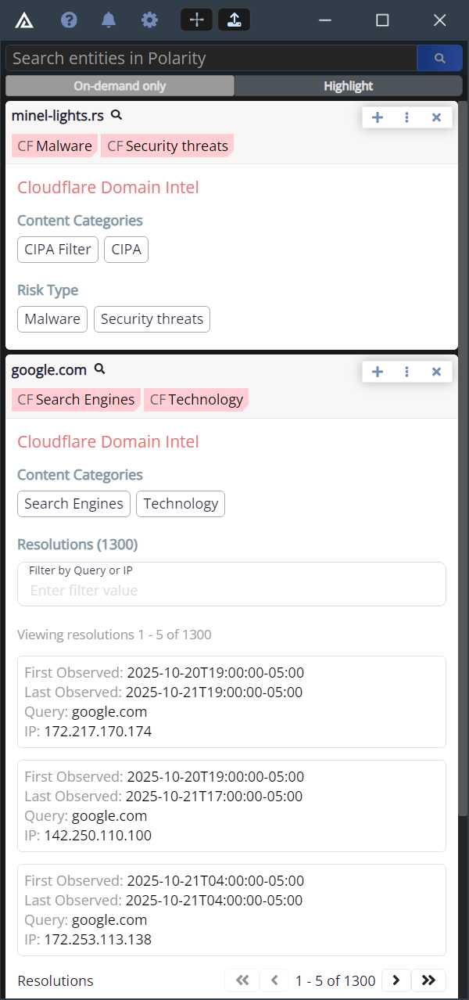

# Polarity Cloudflare Radar Integration

The Polarity Cloudflare integration uses the Cloudflare Domain Intel REST API to return category, risk type, and resolution information for domains. 

To use the integration you will need to sign up for a free Cloudflare account here:

## CloudFlare Domain Intel Integration Options

### Cloudlfare Account ID

Your Cloudflare Account ID associated with the Account API token created below.

For instructions on how to obtain your Account ID see https://developers.cloudflare.com/fundamentals/account/find-account-and-zone-ids/#users-with-a-single-account

### Cloudflare Account API Token

A Cloudflare Account API token with "read" access to the "Intel" API.  For instructions on how to create an Account API Token see https://developers.cloudflare.com/fundamentals/api/get-started/create-token/

Be sure to create an Account API Token (under "Manage Account" -> "API Tokens"), rather than a user token.

## Installation Instructions

Installation instructions for integrations are provided on the [PolarityIO GitHub Page](https://polarityio.github.io/).

## Polarity

Polarity is a memory-augmentation platform that improves and accelerates analyst decision making.  For more information about the Polarity platform please see:

https://polarity.io/
